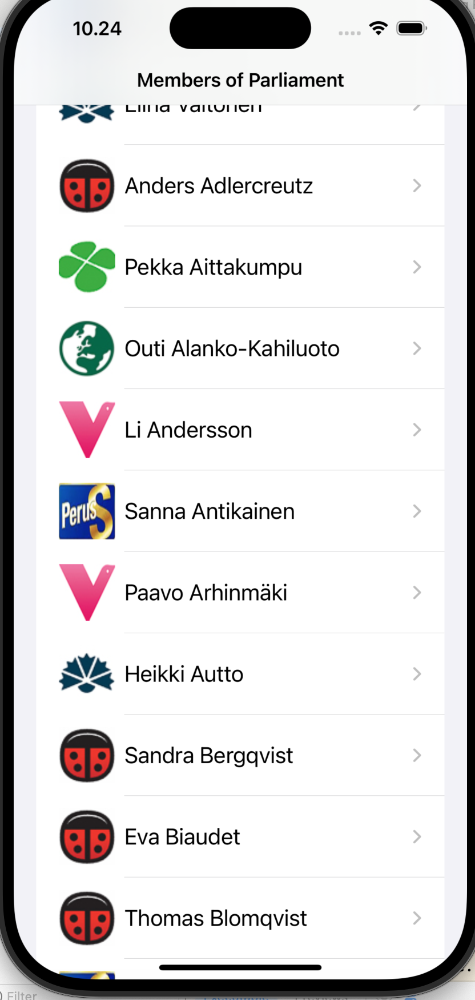
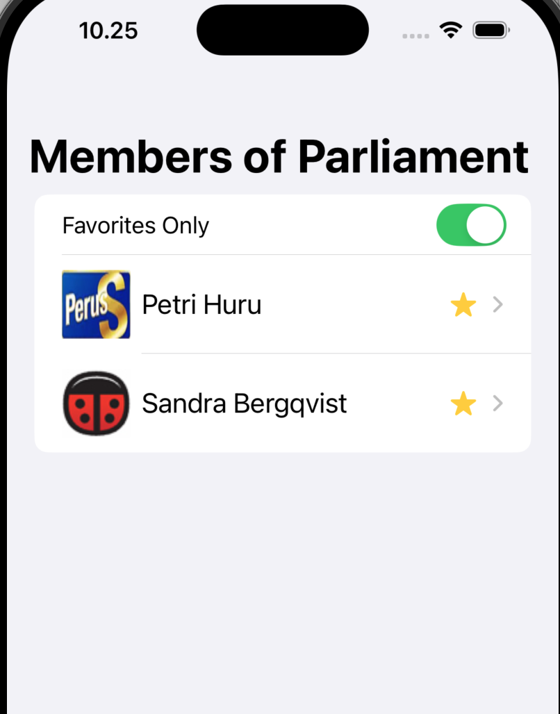
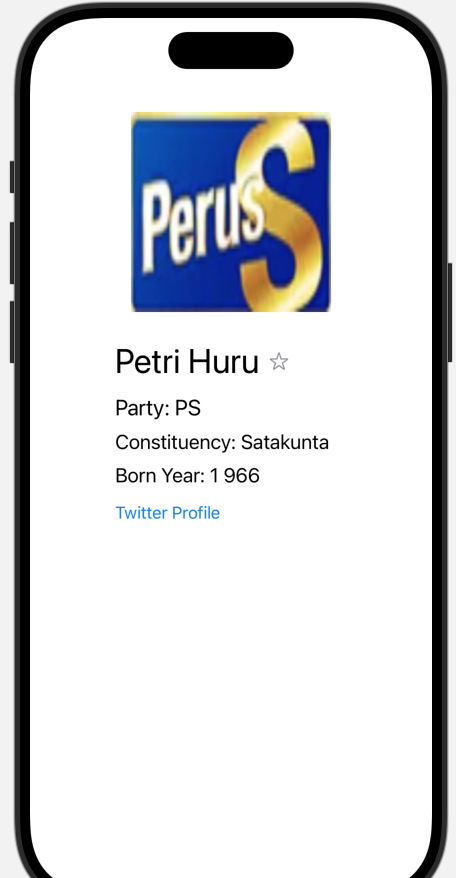

# Finnish Parliament Members App

This app displays a list of Finnish parliament members using SwiftUI's List component. Users can view details about each member and mark members as favorites for easy access.

- Member List: Shows the full list of parliament members.
  

  
   
  <em>Party List</em>

- Favorites: Users can toggle favorites for members they want to highlight.

  
   
  <em>Favorites</em>

- Detail View: Displays additional information about each member.

  
   
  <em>Detailed Screen</em>

## Stack

- Swift
- SwiftUI
- Xcode 12 or later
